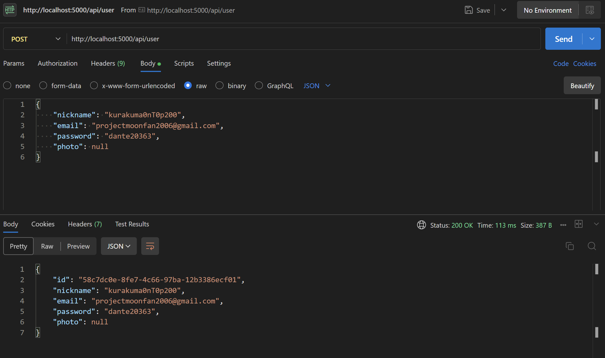
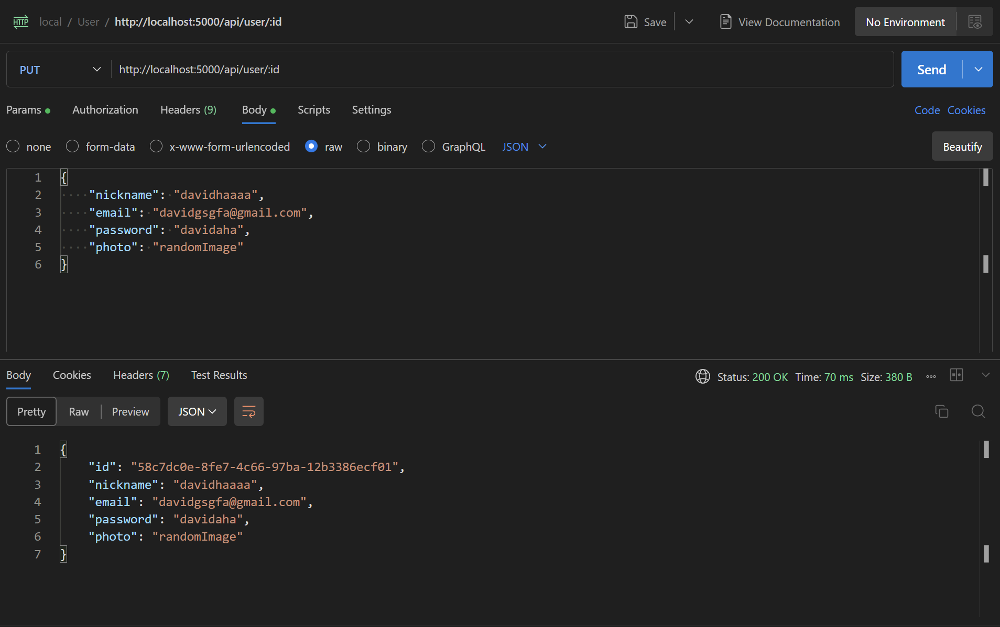
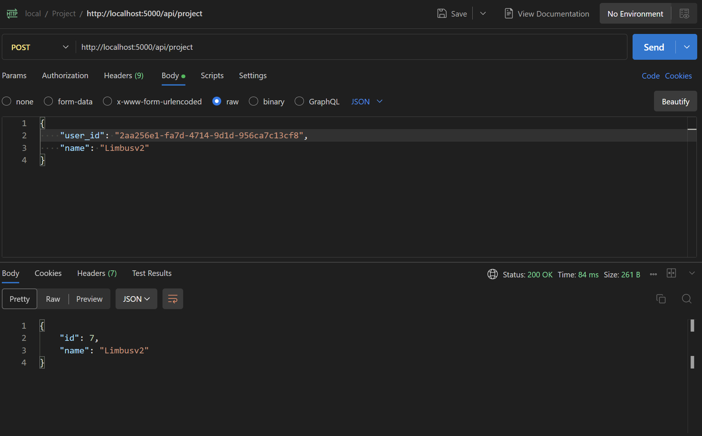
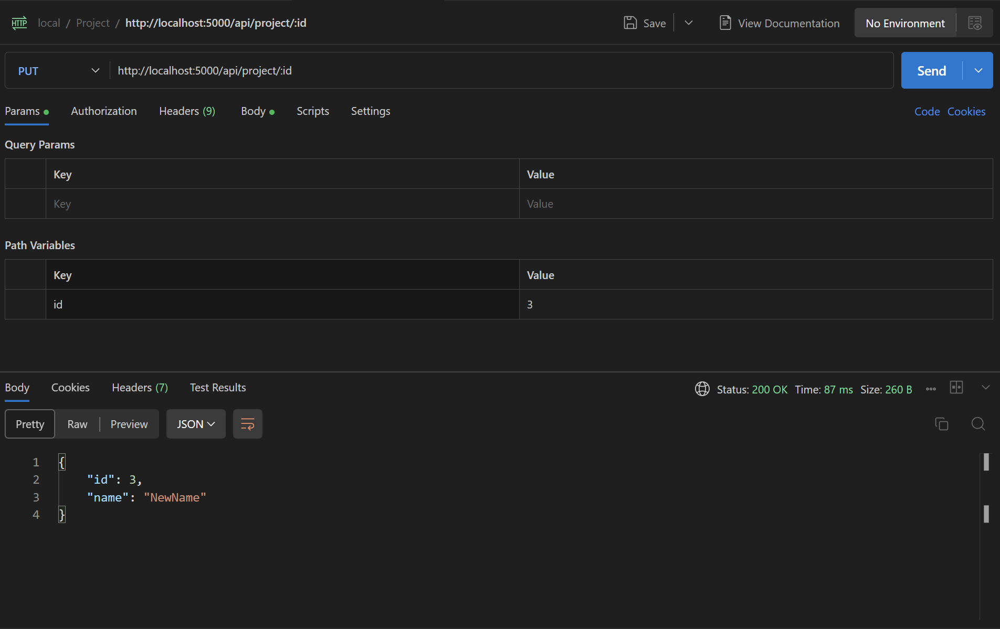

# Тестування працездатності системи

## Запуск серверу

```bash
npm run start 
```

## Перевірка працездатности сервісів

### POST: створити користувача



### GET: отримати всіх користувачів


### GET: отримати користувача по id


### PUT: оновити користувача



### DEL: видалити користувача


### POST: створити проєкт



### GET: отримати всіх проєкти


### GET: отримати проєкт по id


### PUT: оновити назву проєкту



### DEL: видалити проєкт


### GET: отримати проєкти пов'язані з користувачем


